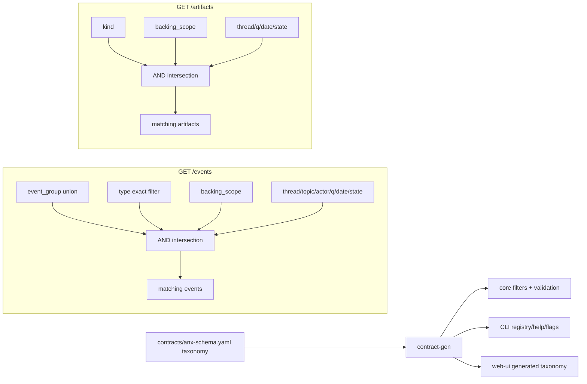

# Catalog completeness, grouping, strict typing, attachment artifacts

## Implementation progress

- [x] Inventory event/artifact taxonomy drift across contracts, core, CLI, web UI, fixtures, and adapter bridge.
- [x] Make `event_type` and `artifact_kind` strict; add `attachment`, `backing_scope`, `event_group`, event taxonomy groups, backing event types, and backing artifact kinds.
- [x] Generate and copy `taxonomy.json` for CLI and web UI consumers.
- [x] Add `GET /events` support for repeatable `event_group`, strict `type` validation, and `backing_scope`.
- [x] Replace artifact `include_system_owned` behavior with `backing_scope` and remove the legacy artifact `thread` alias from OpenAPI/handler flow.
- [x] Update Artifacts and Events UI filters, URL state, and generated taxonomy usage.
- [x] Update CLI `events list` / `artifacts list` flags and generated runtime docs.
- [x] Normalize mock/dev/QA artifact fixture kinds to `attachment` where they represent standalone artifacts.
- [x] Update docs and AGENTS guidance that previously promised open event/artifact type handling.
- [x] Add focused integration coverage for `event_group` and `backing_scope` semantics.
- [x] Final review: removed the lingering `events.stream` HTTP `types` query alias from OpenAPI and handler parsing; CLI `--types` now serializes as repeated canonical `type=` query params.
- [x] Final review: thread-scoped `anx events list --thread-id ...` now applies `--event-group` and `--backing-scope` using embedded contract taxonomy while preserving timeline-expanded artifact output.
- [x] Subagent review: fixed artifact `kind` + `backing_scope` composition and rejected unsupported workspace-wide CLI event lifecycle flags instead of accepting no-ops.
- [x] Validate with `make contract-check`, `make -C core check`, `make cli-check`, and `make -C web-ui check`.

## Executive decision

This should be implemented as a **breaking contract cleanup**, not a compatibility migration.

- No compatibility aliases for query params, event type strings, artifact kind strings, or CLI flags introduced only for the old model.
- No runtime mapping from legacy values to new values.
- Existing SQLite workspaces with unknown `events.type`, unknown `artifacts.kind`, or rows that violate the strict taxonomy are unsupported. Prefer **fail-fast startup/read validation with a clear reset instruction** over silent purge; use a deliberate purge script only for local/dev data.
- Remove `include_system_owned` entirely. The replacement is `backing_scope` everywhere lists need this concept.
- Update generated artifacts and downstream modules in the same change. Older clients against newer core may fail.

## Goal

Operators use Events and Artifacts as dense catalogs. Both pages should be trustworthy and complete by default, then narrowable by resource-shaped filters.

The bug behind this plan is conceptual: document/card body bytes are revision-backed artifact rows (`kind=doc` / `kind=card`), but the artifact catalog historically hid those rows unless `include_system_owned` was passed. That made Artifacts feel incomplete while Events felt like the raw durable ledger.

The desired model:

| Concept | Canonical representation |
| --- | --- |
| Posted message | `message_posted` event on a thread. |
| Topic/document/card/board changes | Typed events in the strict `event_type` enum. |
| Document body bytes | `kind=doc` artifact produced only by document revision machinery. |
| Card body bytes | `kind=card` artifact produced only by card revision machinery. |
| External uploaded blob | `kind=attachment` artifact created through `POST /artifacts`. |

Avoid "system event" wording in UI and docs unless referring to a `system` actor. Lifecycle rows are normal typed ledger events, not a separate system-event class.

## More elegant implementation approach

Do not solve this by adding more hand-maintained lists in every module. Introduce a **contract-owned taxonomy** and generate artifacts from it.

Recommended contract shape in `contracts/anx-schema.yaml`:

```yaml
enums:
  backing_scope:
    enum_policy: strict
    values: [all, standalone, backing_only]

  event_group:
    enum_policy: strict
    values: [messages, topics, documents, cards, boards, attention, notifications, reviews, exceptions]

  event_type:
    enum_policy: strict
    values: [...]
    groups:
      messages: [message_posted]
      documents: [document_created, document_revised, document_restored, document_trashed]
      cards: [card_created, card_updated, card_moved, card_archived, card_trashed, card_resolved]
      boards: [board_created, board_updated]
      topics: [topic_created, topic_updated, topic_archived, topic_restored, topic_trashed]
      attention: [human_attention_requested, human_attention_responded]
      notifications: [agent_notification_read, agent_notification_dismissed]
      reviews: [receipt_added, review_completed]
      exceptions: [exception_raised]
    backing_event_types:
      - document_created
      - document_revised
      - document_restored
      - document_trashed
      - card_created
      - card_updated
      - card_moved
      - card_archived
      - card_trashed
      - card_resolved

  artifact_kind:
    enum_policy: strict
    values: [doc, card, agent_wake, attachment]
    backing_kinds: [doc, card]
```

Exact YAML structure can change to match the generator style, but the important point is ownership: `contracts/` defines taxonomy membership once; `core`, `cli`, and `web-ui` consume generated metadata.

Generate something like `contracts/gen/meta/taxonomy.json` containing:

- enum policies and values for `event_type`, `artifact_kind`, `event_group`, `backing_scope`
- event group -> event type sets
- event type -> group memberships
- backing event type set
- backing artifact kind set
- labels/descriptions where shared clients need them

Then copy/embed it where existing generated metadata is already embedded:

- `cli/internal/registry/`
- `web-ui/src/lib/generated/`
- optionally a small Go package for core, or load from the same schema contract at startup

This avoids the current drift between:

- `contracts/anx-schema.yaml` event values
- `core/internal/primitives/store.go` `HomeFeedEventTypes`
- `cli/internal/app/resource_commands.go` event guidance
- `web-ui/src/lib/artifactKinds.js`
- fixture-only future or informal values

## Contract changes

1. In `contracts/anx-schema.yaml`, change:
   - `event_type.enum_policy: open` -> `strict`
   - `artifact_kind.enum_policy: open` -> `strict`
   - remove text saying unknown event/artifact values must be accepted
   - add `artifact_kind: attachment`
   - add `backing_scope` and `event_group` strict enums
   - add taxonomy metadata for groups and backing membership

2. Reconcile the actual enum list before touching code:
   - Contract currently has `document_revised`; core Home feed also uses `document_revision_created`. Pick one canonical emission. Prefer the currently published `document_revised` unless a real endpoint emits `document_revision_created`.
   - Contract currently has `card_resolved`; core Home feed also has `card_closed` and `card_restored`. Either add emitted values intentionally or delete those emissions/tests. Do not leave "known to core, unknown to contract" values.
   - Contract currently lacks `topic_priority_changed` and `topic_lifecycle_changed` used by `HomeFeedEventTypes`. Prefer folding these into `topic_updated` unless there is a strong product reason to expose them as first-class events.
   - Fixture values like `future_signal_emitted`, `future_unknown_type`, artifact `evidence`, and artifact `log` must be deleted or converted to canonical values.

3. In `contracts/anx-openapi.yaml`:
   - `GET /events`: add repeatable `event_group` and `backing_scope` params.
   - `GET /artifacts`: add `backing_scope`; remove `include_system_owned` if present in generated docs; remove `thread` alias if the breaking cleanup includes query alias removal.
   - Use enum references or explicit enum values for `backing_scope` and `event_group`.
   - Keep repeatable style (`style: form`, `explode: true`) to match existing `type=` behavior.

4. Update generated metadata:
   - extend `core/cmd/contract-gen/main.go` to emit taxonomy metadata
   - update tests that currently assert event types are open (`cli/internal/registry/registry_test.go`, schema validator tests, generated metadata snapshots)
   - run `make contract-gen` and `make contract-check`

## API semantics

### `backing_scope`

Supported values:

- `all`: no backing exclusion
- `standalone`: exclude backing rows
- `backing_only`: include only backing rows

Defaults:

- HTTP default for `GET /events`: `all`
- HTTP default for `GET /artifacts`: `all`
- UI default for catalog pages: `all`
- CLI default for list commands: `all`

Artifact interpretation:

- backing kinds are exactly `doc` and `card`
- `standalone` excludes `doc` and `card`
- `backing_only` includes only `doc` and `card`
- `attachment` is standalone and remains visible under `standalone`

Event interpretation:

- backing membership comes from contract taxonomy `backing_event_types`
- do not infer backing status from actor id, thread id, or the word "system"
- if an event is in both an `event_group` and `backing_event_types`, filters compose by intersection

### `event_group`

`event_group` is repeatable and expands to contract-defined event type sets. Multiple groups mean union within the group dimension; other dimensions still intersect.

Filter composition:

```text
matching events =
  event_group union, if provided
  INTERSECT type filter, if provided
  INTERSECT backing_scope filter, if provided
  INTERSECT topic/thread/actor/q/date/state filters
```

Recommendation: keep raw `type=` in the API and CLI for power users and tests, but make the operator UI groups-first. Removing `type=` would make debugging and exact replay harder without materially simplifying the UI.

## Core implementation

Touch likely areas:

- `core/internal/schema/validator.go`
- `core/internal/schema/contract_test.go`
- `core/internal/server/primitives_handlers.go`
- `core/internal/server/stream_handlers.go` if stream filters should also validate strict event types
- `core/internal/primitives/store.go`
- `core/internal/primitives/store_test.go`
- `core/docs/anx-core-spec.md`
- `core/docs/http-api.md`
- `core/docs/runbook.md`

Required behavior:

- `POST /events` rejects any `event.type` outside strict `event_type`.
- `POST /artifacts` rejects any `artifact.kind` outside strict `artifact_kind`.
- `POST /artifacts` should allow `attachment` and any other explicitly standalone kinds, but still reject client-created `doc` and `card` if those must remain revision-only.
- Document/card revision internals may continue to create `doc`/`card` artifacts through internal store paths.
- `GET /events` validates `type=`, `event_group=`, and `backing_scope=`. Unknown filters return `400 invalid_request`, not silent empty lists.
- `GET /artifacts` validates `kind=` and `backing_scope=`.
- List filters should use generated taxonomy sets, not local string constants.
- Remove `IncludeSystemOwned` from `ArtifactListFilter` and replace it with `BackingScope`.
- Add `EventListFilter.EventGroups` and/or pre-expanded `Types` derived in the handler, but keep expansion deterministic and covered by tests.

Destructive data strategy:

- Preferred: add a startup/readiness check or admin diagnostic that detects invalid rows and returns a clear error naming the reset path. This is safer than silently deleting operator data.
- Local/dev reset docs can say to remove the SQLite workspace DB and reseed.
- If a purge tool is implemented, keep it explicit (`anx-core doctor --purge-invalid-taxonomy` or a script), not automatic.

## Web UI implementation

Touch likely areas:

- `web-ui/src/lib/artifactKinds.js`
- `web-ui/src/lib/artifactFilters.js`
- `web-ui/src/routes/o/[organization]/w/[workspace]/artifacts/+page.svelte`
- `web-ui/src/routes/o/[organization]/w/[workspace]/events/+page.svelte`
- `web-ui/src/lib/devWorkspaceFixtures.js`
- `web-ui/scripts/seed-core-from-mock.mjs`
- `web-ui/scripts/qa-visual.mjs`
- `web-ui/tests/e2e/*.spec.js` for Artifacts, Events, docs, golden path, headless smoke
- `web-ui/docs/spec-compliance.md`
- possibly `web-ui/AGENTS.md` because it currently says unknown event types/artifact kinds must remain visible; after this change that guidance should become "unknown fields remain visible, unknown type/kind is server drift and may show an error."

Required UX:

- Artifacts default to `backing_scope=all`; document/card revision artifacts are visible without hidden flags.
- Add a compact backing-scope control: All / Standalone / Backing only.
- Add `attachment` label, description, and color.
- Keep `kind` filter and `backing_scope` separate. Example: `kind=attachment&backing_scope=backing_only` is valid input but returns no rows.
- Events default to `backing_scope=all`.
- Add grouped event filters using contract taxonomy labels: Messages, Topics, Documents, Cards, Boards, Attention, Notifications, Reviews, Exceptions.
- URL state should preserve `event_group` as repeated params and omit defaults.
- Error display may be generic for contract drift, but it should not silently hide failed loads.

Fixture cleanup:

- Replace artifact `evidence` / `log` with `attachment` plus provenance/summary metadata.
- Replace `future_signal_emitted` and `future_unknown_type` with canonical event types or remove those tests.
- If the UI still needs a resilience test, make it about unknown fields inside a known envelope, not unknown `type` / `kind`.

## CLI implementation

Touch likely areas:

- `cli/internal/app/resource_commands.go`
- `cli/internal/app/help_generated.go` after generation
- `cli/internal/registry/*`
- `cli/internal/app/resource_commands_test.go`
- `cli/internal/app/meta_help_test.go`
- `cli/internal/app/testdata/*golden.json`
- `cli/dogfood-resources/`

Required behavior:

- Help must stop saying event types are open.
- `events explain` should read/generated taxonomy instead of maintaining a separate `knownEventTypeGuidance` list, or at least validate that list against generated taxonomy.
- Add `--event-group` repeatable flag to `events list`.
- Add `--backing-scope all|standalone|backing-only` to `events list` and `artifacts list`. For CLI flags, use hyphenated values only if the transport normalizes to API values; otherwise keep exact API values (`backing_only`) to avoid another alias layer.
- Keep `--type` for exact event filtering.
- Update generated command metadata and examples.
- Dogfood resources must not instruct agents to use non-canonical event/artifact values.

Note: current `events list` composes thread timelines client-side and requires a thread id. Decide whether this plan also upgrades it to call canonical `GET /events` for workspace-wide grouped filtering. More future-proof recommendation: make `events list` use `GET /events` when no `--thread-id` is supplied, and keep thread timeline composition only for thread-scoped reads that need expanded timeline objects.

## Adapter impact

Touch likely areas:

- `adapters/agent-bridge/anx_agent_bridge/models.py`
- `adapters/agent-bridge/anx_agent_bridge/anx_client.py`
- `adapters/agent-bridge/tests/test_bridge.py`
- `adapters/agent-bridge/tests/test_anx_client.py`

Required behavior:

- Bridge-emitted events such as `agent_wakeup_claimed`, `agent_wakeup_completed`, `agent_wakeup_failed`, and `agent_bridge_checked_in` need a decision:
  - add them to strict `event_type` under a `notifications` or `agents` group, or
  - stop emitting them as core events if they are adapter-local telemetry.
- Because this is breaking, do not let adapter event types remain implicit.

## Test plan

Run checks from narrow to broad:

1. `make contract-gen`
2. `make contract-check`
3. `make -C core check`
4. `make cli-check`
5. `make -C web-ui check`
6. Targeted web UI e2e for artifacts/events/docs if the normal check target does not include them.
7. `make check`
8. `make e2e-smoke`
9. `make contract-check-committed` before handoff or push

Add focused tests:

- schema validator rejects unknown strict `event_type` and `artifact_kind`
- `POST /events` rejects unknown type
- `POST /artifacts` rejects unknown kind and rejects direct `doc`/`card` creation if revision-only is enforced
- `GET /events?event_group=documents` expands correctly
- repeated `event_group` unions groups
- `event_group` + `type` intersects
- `backing_scope=standalone` excludes backing event types / `doc` / `card`
- `backing_scope=backing_only` includes only backing event types / `doc` / `card`
- invalid `backing_scope`, `event_group`, `type`, and `kind` return `400`
- Artifacts page default request includes or implies `backing_scope=all`
- Events page grouped filter URL round-trips

## Open decisions before implementation

| Topic | Recommended decision |
| --- | --- |
| Invalid existing DB rows | Fail fast with reset instructions; optional explicit local purge script. |
| Raw `type=` filter | Keep in API/CLI; make UI groups-first. |
| Backing event membership | Include document/card lifecycle/revision events; keep topic/board/message events standalone unless they are purely revision backing. |
| Adapter wakeup event types | Add to strict enum intentionally or move to adapter telemetry; do not leave implicit. |
| Direct `POST /artifacts kind=doc/card` | Reject; those kinds are internal revision backing only. |
| Query aliases | Remove `include_system_owned`; remove `thread` alias if this rollout owns alias cleanup. |

## Rollout sequence

1. **Inventory drift.** Generate a list of every event type and artifact kind emitted by core, adapters, fixtures, CLI dogfood resources, and web UI tests. Decide the final strict lists.
2. **Contracts first.** Update schema/OpenAPI/taxonomy metadata and generator tests.
3. **Core validation and filters.** Implement strict writes, strict list param validation, `backing_scope`, and `event_group`.
4. **Generated consumers.** Regenerate contracts and update embedded CLI/web metadata.
5. **Fixture and seed cleanup.** Update mock, QA, and dogfood data before relying on strict core.
6. **UI.** Add catalog defaults, grouped filters, labels, and URL state.
7. **CLI/adapters.** Update flags, help, adapter event taxonomy, and tests.
8. **Docs.** Update core/web-ui/CLI docs and any AGENTS guidance that still promises unknown type/kind graceful handling.
9. **Full validation.** Run the validation ladder above and fix generated drift before handoff.

## Diagram


